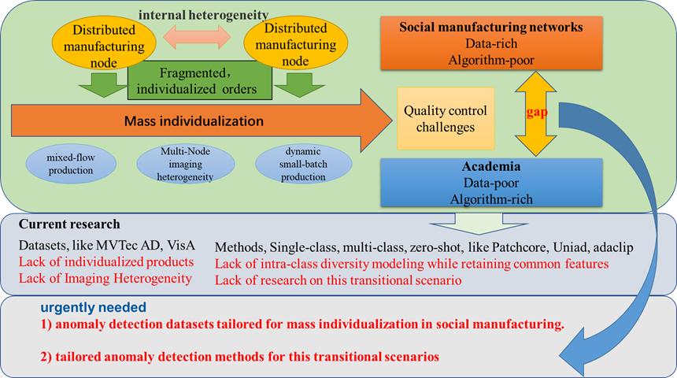
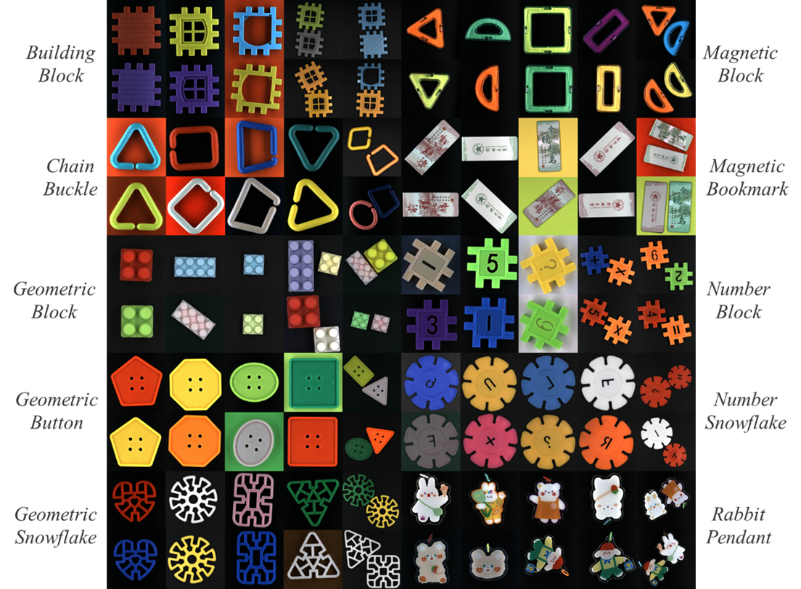
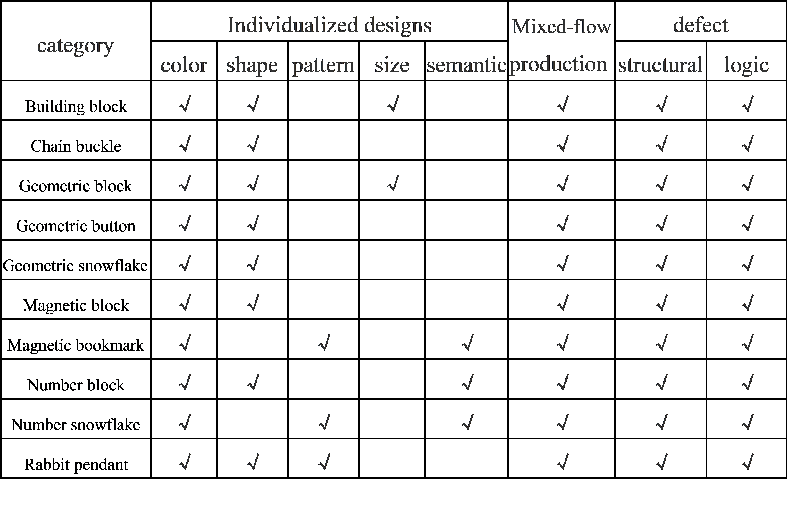
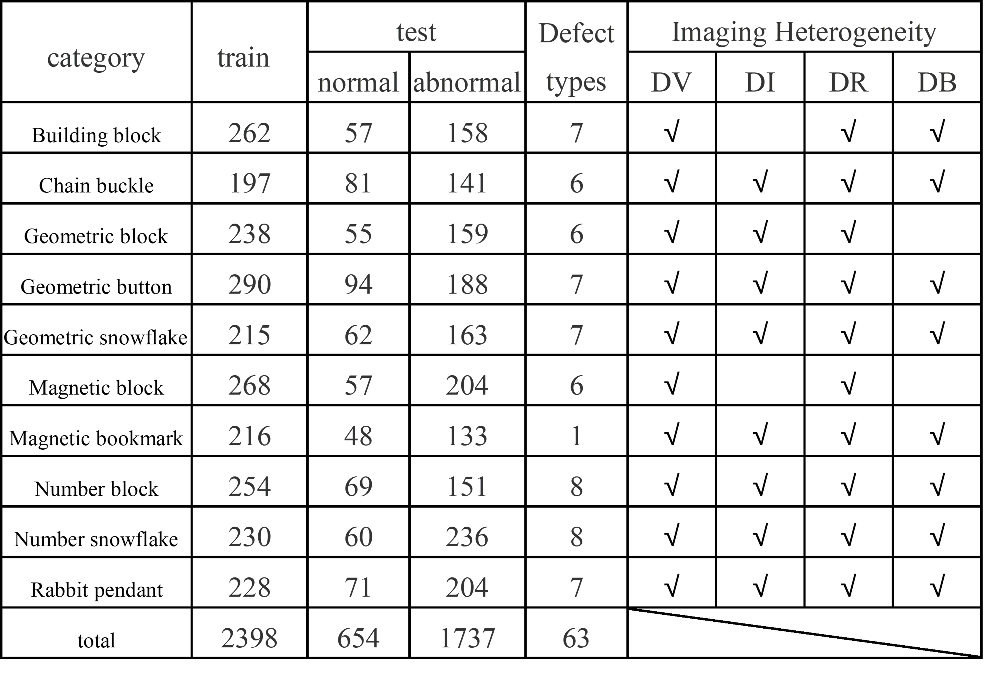

# MIRAD - A comprehensive real-world robust anomaly detection dataset for Mass Individualization

Pulin Li, Guocheng Wu, Yanjie Zhou, Yuxin Zheng, Wei Zhang.

## Table of Contents
* [Introduction](#introduction)
* [Data description](#data-description)
* [Data download](#data-download)
* [Data preparation](#data-preparation)
* [Metric computation](#metric-computation)
* [Citation](#citation)
* [License](#license)

## Introduction
This repository contains the resources for our paper ["MIRAD - A comprehensive real-world robust anomaly detection dataset for Mass Individualization"](https://arxiv.org/pdf/2207.14315.pdf). Currently we release the Mass Individualization Robust Anomal Detection (MIRAD) dataset. 



## Data description


MIRAD, comprising 10 categories of individualized products, encompasses three design paradigms, including geometrically complex components (Geometric Blocks, Buttons), numerically and symbolically encoded items (Number Blocks with Arabic numerals, mathematical symbols), and stylized artifacts (Rabbit Pendants, Magnetic Bookmarks). Each product category offers diverse options in color, shape, pattern, and size, covering one or even all three design paradigms.It specifically incorporates multi-object inspection scenarios where two or more individualized products coexist within single frames. The MIRAD dataset comprises 2398 defect-free training images and 2391 test samples, with 1737 test images containing pixel-level annotated defects. Distributed production nodes employ diverse motion and illumination strategies, different camera specifications , and node-specific background, collectively mirroring the diversity of real-world dis manufacturing networks. Both surface defects and logical flaws are captured under node-specific imaging conditions.
The MIRAD dataset bridges the gap between laboratory research and practical quality control in mass individualization under the context of social manufacturing. 

### Individualized designs

### Statistical overview



## Data download

We host the MIRAD dataset in AWS S3 and you can download it by this [URL](https://amazon-visual-anomaly.s3.us-west-2.amazonaws.com/VisA_20220922.tar). 

The data tree of the downloaded data is as follows.
```shell
MIRAD
|-- building_block
|-----|--- train
|-----|-----|----- good
|-----|--- test
|-----|-----|----- good
|-----|-----|----- anomaly
|-----|--- ground_truth
|-- chain_buckle
|-----|----- ...
```

 
## Metrics computation
Based on MIRAD, we explore how existing anomaly detection models perform when confronted with the individualized products, as well as their robustness to imaging heterogeneity across distributed production nodes. Specially, we evaluate three kinds of approaches on MIRAD dataset, including single-class, multi-class and zero-shot detection models, providing a foundation for future analyses.


## Citation
Please cite the following paper if this dataset helps your project:

```bibtex
@article{zou2022spot,
  title={SPot-the-Difference Self-Supervised Pre-training for Anomaly Detection and Segmentation},
  author={Zou, Yang and Jeong, Jongheon and Pemula, Latha and Zhang, Dongqing and Dabeer, Onkar},
  journal={arXiv preprint arXiv:2207.14315},
  year={2022}
}
```

## License
The data is released under the CC BY 4.0 license.
